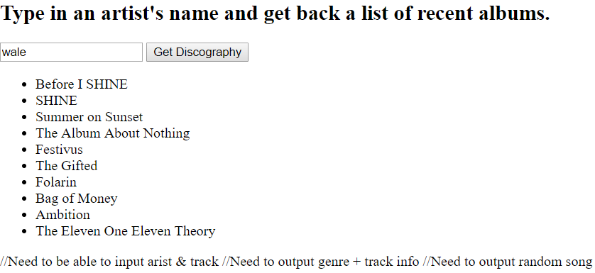

# Discography title & description generator
This was my first time creating my own complex API out of 2 different API's that I chose. The audio DB api pulls the name of the artist from the input and generates a list of albums. Upon clicking on an item, the wikipedia api searches that item and generates a description if an article is found.

## How It's Made:

**Tech used:** HTML, CSS, Javascript

Really just used some basic HTML & CSS along with the ES6 I used after fetching the data from NASA.

## Optimizations
There's plenty that can be done here. Primarily, I want to change hte code so that the list resets when you click the button again. I'd also like to be able to remove single albums on click. Really, the only further optimization code wise would be adding other APIs to have more functionality by doing things like generating track details per album or being able to store information in a separate list or play actual songs from clicked albums.

I'd also like to generate not just a wiki description, but also the title of the article and a link to it. Ideally also the first image in the article which will likely be the album art.

## Lessons Learned:

I learned it's obnoxious dealing with responses from API's as the arrays that get returned are not always consistent and you don't have as much control/manipulation as would be ideal.
